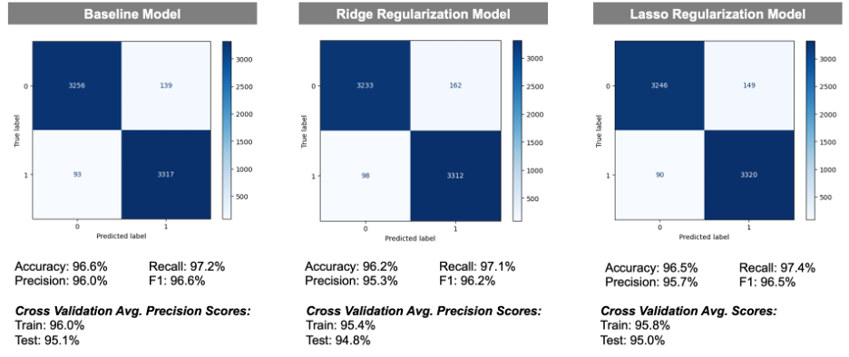
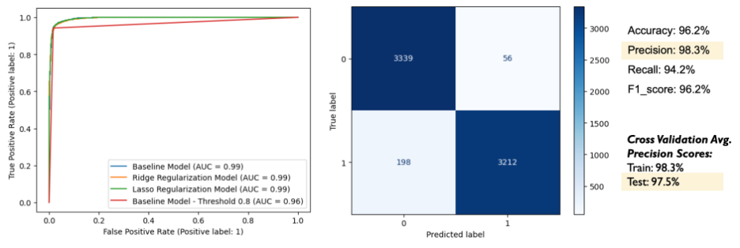
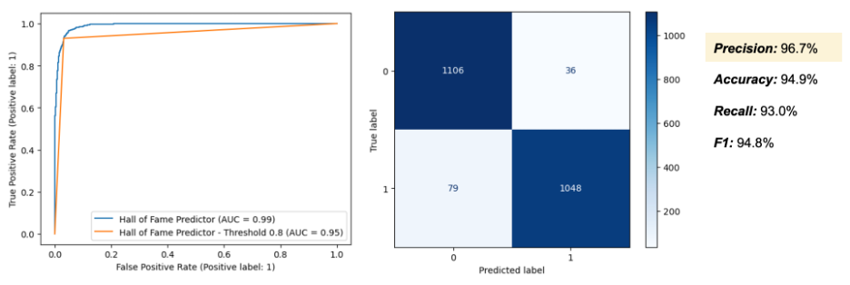

# Hockey-Classifier-Project
Author: [Emily Krueger](https://github.com/ekrueger1217)

## Business Overview
Krueger Hockey Consulting has developed a hall of fame predictor model designed to be used by the NHL each year to evaluate former players who are hall of fame eligible.

## Data Overview
In building this model, we used data from a professional hockey database which can be found [here](https://www.kaggle.com/datasets/open-source-sports/professional-hockey-database/). The data ranges from 1917 to 2011. This database includes 22 csv files with team, player, and league information, of which, our analysis uses the following:

1. Master: names and biographical information
2. Scoring: scoring statistics by player, year, and team
3. Teams: Team regular season statistics
4. TeamsPost: Team postseason statistics
5. SeriesPost: Postseason series results and statistics
6. HOF: Hall of Fame information

The resulting dataframe used in building and evaluating this model contains 4,722 rows and 41 columns with biographical player information (such as birth country, height, and weight) and career statistics (such as avg. points per season and career +/-). We excluded anyone who retired after 2007, as players must be out of the league for at least three years to be hall of fame eligible. We also excluded goaltenders, as they are evaluated on different statistics and should be modeled seperately.

## Modeling
In building our hall of fame predictor model, we began with a baseline logistic regression before engaging in hyperparameter tuning. The primary hyperparameter we were concerned with was penalty, and below we compare our baseline model to a l2 regularized iteration and a l1 regularized iteration. We used precision as our evaluation metric, as we view hall of fame as a highly exclusive award and therefore, want to limit the number of false positives our model produces.

We flexed other hyperparameters such as max iterations and solver, and repeatedly, our baseline model produced the highest precision score.

In addition, we flexed the threshold at which our model would declare someone a hall of famer. In increasing threshold to 0.8, we increased our cross validated test precision score to 98.3%, while keeping accuracy above 95%.

## Final Model Evaluation
Thus, our final model, is our baseline model (logistic regression, penalty=None, max_iter=5000, random_state=42) with the threshold set to 0.8. When tested on unseen data, this model produced a precision score of 96.7% and an accuracy score of 94.9%. 

## Conclusion
Recommendations:
- Utilize our baseline model with a threshold set to 0.8 as a tool to determine who should be inducted into the hall of fame each year
- Put greater focus on candidates who are not US born or are from MN, MA, or MI, as these were some of the most impactful features
- In addition, put focus on recently eligible players who have played many NHL games and have a high average goals per season in comparison to peers, as these were also some of the most impactful features

Additional Considerations/Next Steps:
- Opportunity to retrain model with more recent data given dataset ends in 2011
- Utilize more advanced models to improve precision
- Build an additional model to evaluate goaltenders
- Develop a modified version of this model to assess current players’ potential when contemplating trades or evaluating players in free agency

## Additional Materials
Please review our full analysis in our [Jupyter Notebook](./Hockey-Classifier-Project.ipynb) and our [Presentation](./Hockey-Classifier-Presentation.pdf) 

